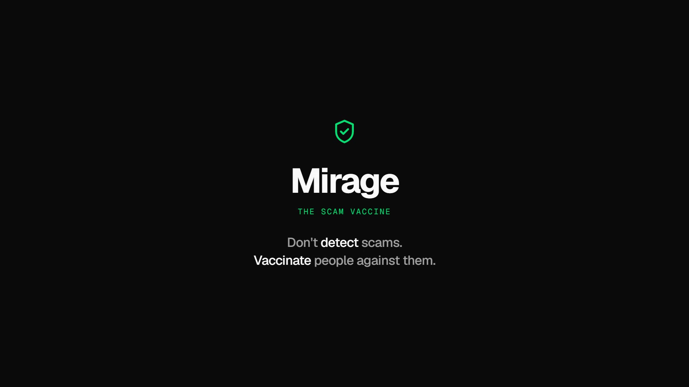
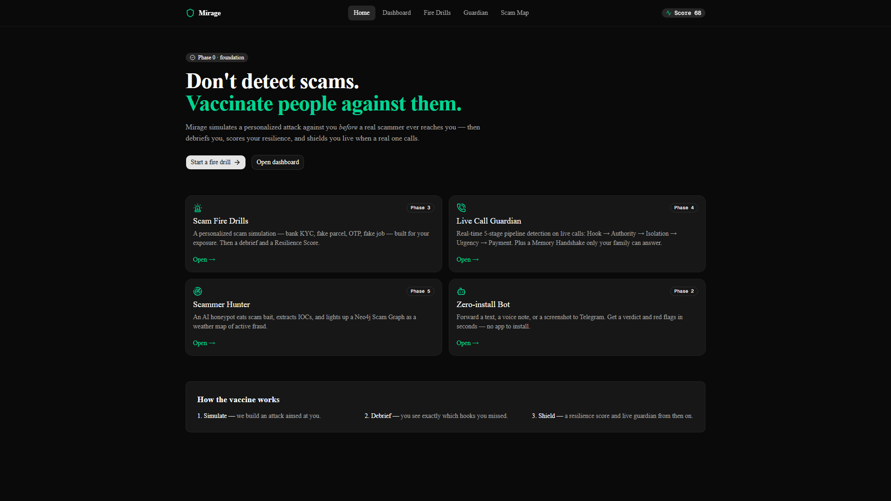
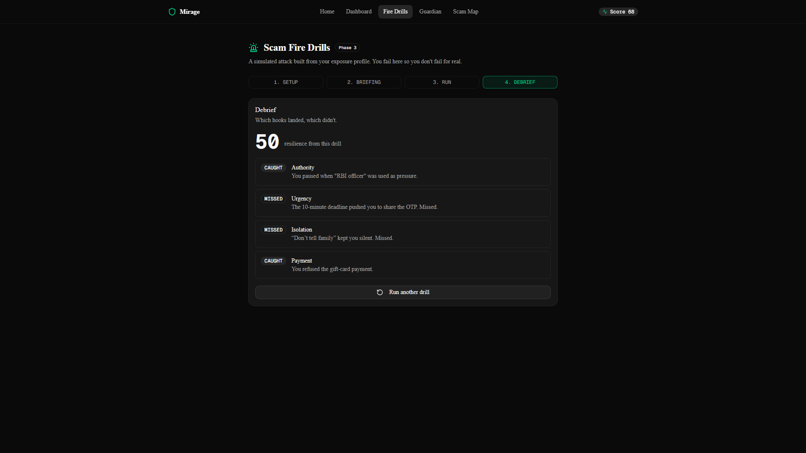
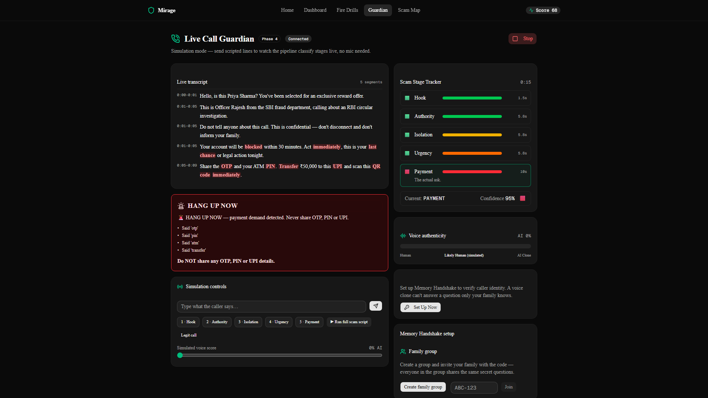
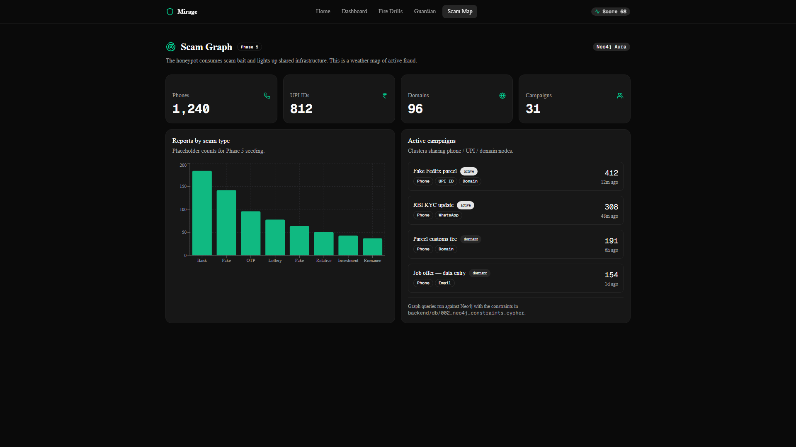
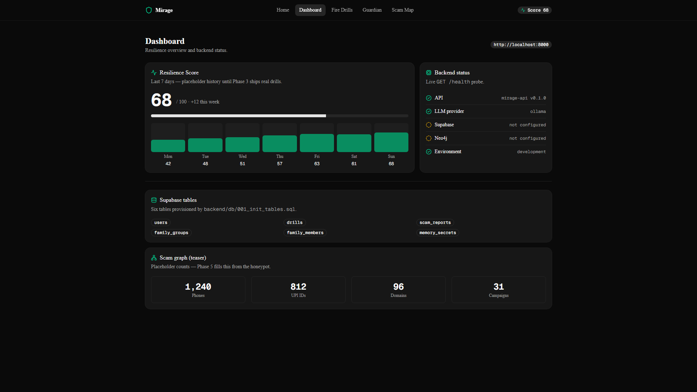
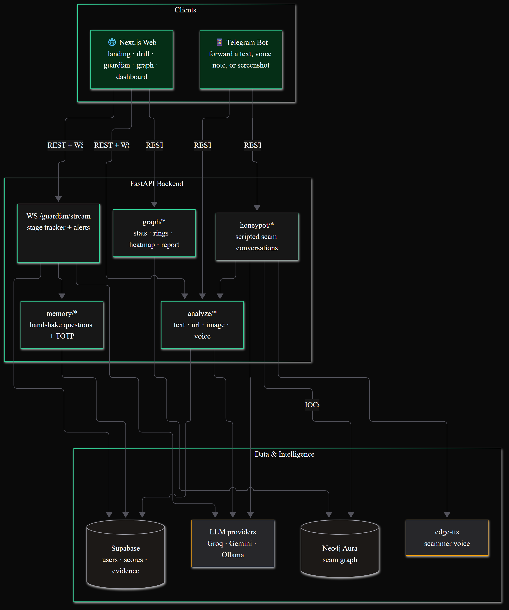
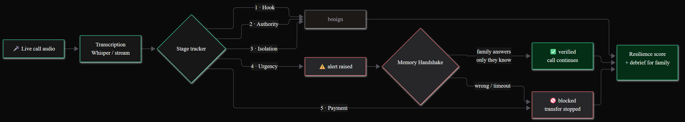
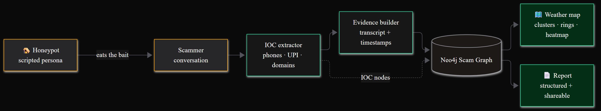

<div align="center">


# Mirage — The Scam Vaccine

**Don't detect scams. Vaccinate people against them.**

[](LICENSE)
[](https://github.com/bhuwanb23/mirage/actions/workflows/ci.yml)
[](frontend)
[](backend)
[](backend)
[](bot)

Mirage simulates a personalized attack against you *before* a real scammer ever reaches you — then debriefs you, scores your resilience, and shields you live when a real one calls.

[Quick start](#quick-start) · [Architecture](#architecture) · [Layers](#layers) · [Docs](#documentation) · [Contributing](CONTRIBUTING.md)



</div>

---

## Why

Scam calls work because they catch you cold. By the time you realize the "bank officer" is lying, you've already said the OTP out loud.

Mirage inverts the timeline. It runs the attack on you first — bank KYC, fake parcel, OTP fraud, fake job offers — debriefs every hook you missed, and gives you a Resilience Score. Then it shields you live when a real one calls, counting the scam pipeline stage by stage and alerting before the transfer.

<div align="center">

| Landing | Fire Drill | Live Guardian |
|:---:|:---:|:---:|
|  |  |  |

| Scam Graph | Dashboard |
|:---:|:---:|
|  |  |

</div>

## Layers

| Layer | What it is | Phase |
|-------|-----------|-------|
| **Scam Fire Drills** | Personalized simulated scam + debrief + Resilience Score | 3 |
| **Live Call Guardian** | Real-time 5-stage pipeline detection + Memory Handshake | 4 |
| **Scammer Hunter** | AI honeypot → IOC extraction → Neo4j Scam Graph → weather map | 5 |
| **Zero-install Bot** | Telegram bot: forward text/voice/screenshot → verdict in seconds | 2 |

### How the vaccine works

1. **Simulate** — Mirage builds an attack aimed at you, from your exposure profile.
2. **Debrief** — you see exactly which hooks you missed, and why.
3. **Shield** — a Resilience Score and a live guardian from then on.

## Architecture

<p align="center">
  
</p>

Three deployable services share one analysis engine:

- **Next.js web** — landing, fire drills, live guardian, scam graph, dashboard
- **FastAPI backend** — analysis (`text · url · image · voice`), guardian WebSocket, honeypot, memory handshake, graph APIs
- **Telegram bot** — zero-install surface for families

Data lives in **Supabase** (users, scores, evidence) and **Neo4j** (the scam graph). LLM providers are pluggable — Groq, Gemini, or local Ollama — with automatic fallback.

### Live Call Guardian

The guardian watches a live call and climbs the 5-stage scam pipeline in real time. At urgency or payment it raises an alert and triggers the **Memory Handshake** — questions only family can answer.

<p align="center">
  
</p>

### Scammer Hunter

An AI honeypot eats the bait, extracts IOCs (phones, UPI IDs, domains), and lights up a Neo4j Scam Graph — a weather map of active fraud clusters.

<p align="center">
  
</p>

## Tech stack

| Layer | Tech |
|-------|------|
| Frontend | Next.js 16 (App Router), React 19, Tailwind CSS 4, shadcn/ui, Recharts |
| Backend | FastAPI, Pydantic, uv, httpx |
| Bot | python-telegram-bot |
| Data | Supabase (Postgres), Neo4j Aura |
| Intelligence | Groq · Gemini · Ollama (pluggable), edge-tts, Whisper |
| Deploy | Render (blueprint in [`render.yaml`](render.yaml)) |

## Quick start

Requires [uv](https://docs.astral.sh/uv/) (Python) and Node.js 20+.

### 1. Backend

```bash
cd backend
uv sync
cp ../.env.example .env    # fill in keys — empty values are fine in development
uv run uvicorn app.main:app --reload --port 8000
# verify: http://localhost:8000/health
```

### 2. Frontend

```bash
cd frontend
npm install
echo "NEXT_PUBLIC_API_URL=http://localhost:8000" > .env.local
npm run dev
# verify: http://localhost:3000
```

### 3. Bot (optional)

```bash
cd bot
uv sync
cp ../.env.example .env    # set TELEGRAM_BOT_TOKEN
uv run python main.py
```

All keys are documented in [`.env.example`](.env.example). Nothing is required in development — missing providers are skipped with a warning. See [`docs/deploy.md`](docs/deploy.md) for production deploys (Supabase → Neo4j → LLM keys → Render).

## Testing & linting

```bash
# Backend — no API keys needed (tests mock the LLM)
cd backend && uv run pytest && uv run ruff check

# Bot
cd bot && uv run pytest && uv run ruff check

# Frontend
cd frontend && npm run lint && npm run build
```

CI runs all three on every push and pull request ([`.github/workflows/ci.yml`](.github/workflows/ci.yml)).

## Project structure

```
mirage/
├── frontend/    # Next.js (App Router) — landing, dashboard, drill, guardian, graph
├── backend/     # FastAPI — analysis engine, guardian WS, honeypot, graph, memory
├── bot/         # Telegram bot (zero-install surface)
├── ml/          # Voice cloning notebook + deepfake detection experiments
├── docs/        # Idea, plans, API contracts, deploy guide, diagrams & screenshots
└── brag-output/ # Launch video pipeline (marketing artifact)
```

## Documentation

| Doc | What's in it |
|-----|-------------|
| [Idea](docs/idea/idea.md) · [Tech stack](docs/idea/tech_stack.md) | Why Mirage exists, strategic architecture |
| [Master plan](docs/plans/master_plan.md) | Phase 0–7 roadmap and dependency tree |
| [API contracts](docs/api_contracts.md) | HTTP/WS contracts with JSON examples |
| [Deploy guide](docs/deploy.md) | Supabase → Neo4j → LLM → Render, step by step |
| [Docs index](docs/README.md) | Full entry point for everything in `docs/` |

## Contributing

Contributions are welcome. Read [CONTRIBUTING.md](CONTRIBUTING.md) for setup, style, and PR guidelines. By participating you agree to the [Code of Conduct](CODE_OF_CONDUCT.md).

Found a vulnerability? Please report it privately via [GitHub Security Advisories](../../security/advisories/new) — see [SECURITY.md](SECURITY.md).

## License

[MIT](LICENSE) © Bhuwan
